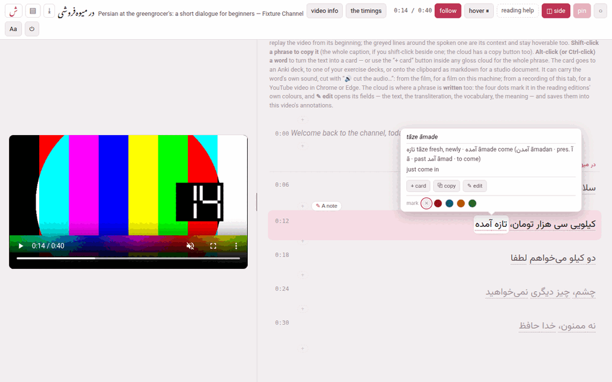

## Reading a transcript

The video sits at the top of the page (or at its left, side by side) and the
whole transcript runs underneath, one line per caption, each with its time
in front of it. The line is cut into **phrases** — the small units a gloss
translates as one thing — and each phrase is underlined with a dotted line.

**Point at a phrase** and its cloud opens: the reading in kana (Japanese),
the transliteration, the vocabulary line, the meaning, and a note where
the automatic transcript heard something wrong. Words of the video's
language inside a vocabulary line or a meaning are set in the language's
own face and direction, so a Persian word inside an English sentence reads
the right way round.

**Click a line** — or its time — and the video plays from that line's
beginning. That is the main way to work: hear it, read the cloud, click,
hear it again. A click that ends a text selection does not replay, so you
can still select words to copy them.

**While the video plays, the line being spoken is lit**: full ink on a
tinted band. The lines just before and after it are grey, and the rest
fainter still. Nothing is hidden, and every line stays hoverable, because a
sentence often runs over two or three captions — the neighbours are the
context you need, and the fade tells you where you are. Before the video
has started, every line is in full ink.

A few lines look different on purpose:

- **A chapter heading** stands above the caption it opens: the title of a
  chapter marker the uploader put in the transcript (`Capitolo 3: Al
  mercato` gives *Al mercato*).
- **A caption entirely in another language** — the English opening many
  lessons start with — is grey and italic and has no phrases: it is never
  glossed.
- **A run drawn bare** inside a caption — a phrase marked plain, or a
  stretch of English in a Persian line (a run with none of the language's
  own script and nothing glossed on it) — is plain text with no cloud.
  A phrase **of the language** that nobody has glossed yet is never bare:
  it is a phrase like any other, hoverable, with a cloud that says
  *nothing glossed yet* and a ✎, so that it can be written
  ([Editing a phrase](editing-a-phrase.md)) or looked up
  ([Reading help](reading-help.md)).

## Copying, and making cards

- **Shift-click a phrase** to copy its text; **Shift-click beside the
  phrases**, on the line, to copy the whole caption. While Shift is held,
  the phrase under the pointer is outlined. The cloud's **⧉ copy** button
  copies the phrase too, which is the way on a touch screen.
- **Alt-click (or Ctrl-click, or ⌘-click) a word** to make a card of that
  very word, with the phrase's meaning, the caption as its context and the
  vocabulary as its notes. While one of those keys is held, the word under
  the pointer lights up. **+ card** in a cloud does the same for the whole
  phrase. The card can go to an Anki deck, to one of your exercise decks,
  or onto the clipboard as studio markdown, and it can carry the word's own
  sound and a frame of the video — the section *Cards and Anki* explains
  the sheet.

The cloud also has **✎ edit** and a row of four colours, which write into
the video: see [Editing a phrase](editing-a-phrase.md).

## The bar

Every control, left to right:

| Control | What it does |
|---|---|
| **ش** | back to the hub |
| **▤** | the channel's page: all its videos |
| **⤓** | download the video as one zip another Parseh can install — its tooltip gives the size when the zip carries a film ([Taking videos away](downloads-and-backups.md)) |
| the title | the title in the video's language, then in Latin letters, and the channel |
| **video info** | the title, the channel, the level and the blurb, edited ([Video info](video-info-and-drafts.md)) |
| **the timings** | moves where each caption starts ([The timings](the-timings.md)) |
| **gloss with an LLM** | a panel that copies a prompt for a run of captions you pick, and fills in the answer where nobody has glossed ([Glossing captions with an LLM](glossing-with-an-llm.md)) |
| `0:14 / 0:40` | where the video is, and how long it is |
| **follow** | keeps the spoken line in view (on until you turn it off) |
| **hover ⏸** | pauses the video while a cloud is open (off until you turn it on) |
| **dictionary** | reading help under a phrase nobody glossed; shown once there is something to help with ([Reading help](reading-help.md)) |
| **definitions**, **in english** | the dictionary's own definitions, and the same translated; only where the dictionary defines its words in their own language |
| **kana** / **pinyin** | Japanese and Chinese: the transcript as its reading alone |
| **reading help** | the page that sets up dictionaries, corpora and translation models, `/lookup/` |
| **◫ side** | the video beside the transcript instead of above it |
| **pin** | keeps the video in view while you scroll (on until you turn it off) |
| **○** / **●** / **◐** | the theme — light, dark, sepia — one setting for the whole toolbox |
| **Aa** | text and margins |
| **⏻** | stops the Parseh server |
| **Decompose Kanji** / **Decompose Hanzi** | Japanese and Chinese: a character's components ([Reading help](reading-help.md#decomposing-a-character)) |

A button that is lit (filled with the accent colour) is on. Every one of
these switches is remembered in this browser and holds for every video.

### follow

With **follow** on, the page scrolls as the video plays so that the spoken
line stays on screen. It waits for you: for two and a half seconds after
you turn the mouse wheel or drag the page with a finger, it leaves the page
where you put it, so you can read ahead or look back without a fight.
Turning **follow** on brings the spoken line back into view at once.

### hover ⏸

With **hover ⏸** on, pointing at a phrase pauses a playing video, and
moving off it lets the video go on — after a third of a second, so that
moving from one phrase to its neighbour does not make it stutter. It turns
the page into something you read at your own pace without touching the
keyboard. The video does not start again underneath a card sheet, and if
you press play yourself in the meantime, it leaves that alone.

### pin, and the grip

With **pin** on (the default), the video stays stuck under the bar while
the transcript scrolls beneath it. Off, it scrolls away with the page,
which leaves the whole window to the text.

The little pill under the video is a **grip**. Drag it down for a bigger
video, up for a smaller one — the height follows the width, at 16:9 — and
double-click it to go back to the default size. The size is remembered.

### Side by side

**◫ side** puts the video in a column on the left and the transcript on the
right. On a wide screen it is usually the better way to work: the video
keeps a decent size instead of being squeezed into the top of the window,
and far more of the transcript is in view at once.

- The grip becomes the **divider** between the two columns and drags
  sideways; the video fills whatever width you give its column, from a
  narrow one up to about three quarters of the window.
- **pin** is greyed out: beside the text the video is always in view, so
  there is nothing left for pinning to decide.
- The two layouts remember **their own sizes**, because the grip resizes a
  different thing in each; a double-click forgets the size of the layout
  you are in.
- Below 860 pixels of window width there is no room for two columns, and
  the page stays stacked whatever the setting says. Widen the window again
  and it goes back to side by side.

### Aa: text and margins

**Aa** opens a small panel, **text & margins**, of sliders that apply at
once and are remembered in this browser:

| Slider | Range | Starts at |
|---|---|---|
| the language's name (**Persian**, **Japanese**…) — the transcript's text | 14–36 px | 20 px |
| **glosses** — the text of the cloud | 10–20 px | 12.5 px |
| **width** — the transcript's column | 480–1400 px | 760 px |
| **leading** — the space between lines | 0.7–1.6 × | 1 × |
| **character spacing** (Japanese and Chinese) | 0–1 em | 0 |
| **reading contrast** (Japanese) — how dark the kana over the kanji are, from the quiet grey (0) to full ink (100) | 0–100 % | 0 |
| **reading / kanji size** (Japanese) — the kana's size against the kanji's | 10–200 % | 50 % |

**reset** puts every slider back; **✕** or Esc closes the panel.

### ⏻

**⏻** stops the Parseh server, after asking. If something is still at work
— a download being packed, a video being added — it names it first and asks
whether to stop anyway, because stopping cuts it off. Every page of Parseh
has the same button.

## A link to a moment

An address ending in `#t=` and a number of seconds —
`/youtube/v/<id>/#t=95` — opens the player with the video at that
second. The cards you make from a video carry such a link back to the
moment they were made at.

## When the video cannot play

- **A YouTube video that will not start**: the video's place says what
  actually happened — *YouTube's player could not be fetched*, or *was
  fetched but never started* — with **Try again**, which retries without
  reloading the page, and **Watch it on YouTube**. It no longer blames your
  connection for something it has not tested: a slow tunnel is not a missing
  internet, and the wait is given twenty seconds before anything is said. The
  transcript works throughout: the glosses, the clouds and everything you
  write are on this machine. **On a phone over Tailscale this is usually
  DNS**, not a broken connection, and the box says where to read about it:
  [a phone on Tailscale that cannot reach the
  internet](../getting-started/other-devices.md#a-phone-on-tailscale-that-cannot-reach-the-internet).
- **A film on this machine** needs no internet at all. If its file has gone
  missing the page says *the film that belongs to this video is not here any
  more*; if the browser cannot play or decode it, it says that instead
  ([A film on this machine](a-film-on-this-machine.md#when-the-film-will-not-play)).

Only what needs the video itself waits for it. [The timings](the-timings.md)
play the video, so until it has loaded — no internet, a film gone or one
the browser cannot play — they answer *the player has not loaded yet*; and
a card's sound clip, which is cut from the video, cannot be made from a
YouTube video that has not loaded or from a film that is gone.

## On a phone

A phone has nothing to hover with, so a **tap** on a phrase opens its cloud
and a second tap closes it — on any screen, including one that claims a
hover it never delivers. A tap elsewhere on the line still plays it from its
beginning. On a narrow screen the bar slides out of the way as the page
moves down and comes back on the smallest move up, bringing the video with
it; a desktop is left exactly as it is.

## While something is working

When the player is packing a download, the small **Working** pill of every
Parseh page says so, and the hub lists it too, until it is done. The
download itself is the browser's: the file appears in your downloads when
the zip is ready.
