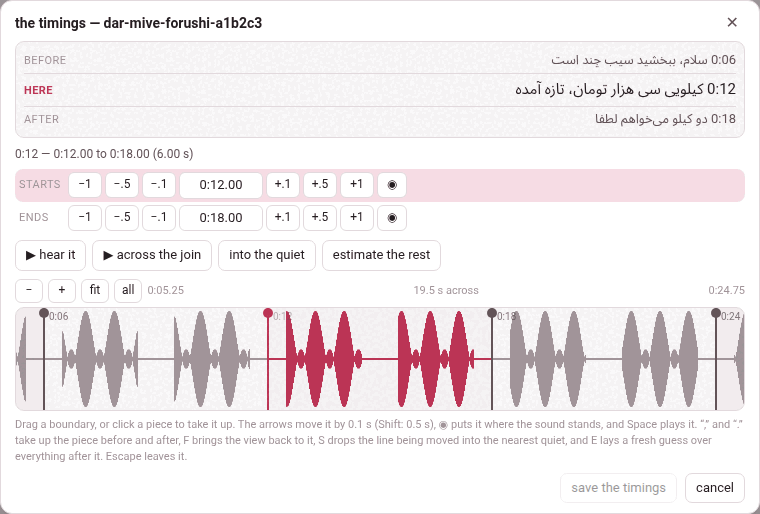

**the timings**, in the player's bar beside **video info**, moves where each
caption **starts** — and nothing else — on a video that is already on the
shelf. The transcript editor of the add page does this *before* a video is
added; this is the one door that does it afterwards.

## Why only the start

A caption's text must equal its line of `transcript.txt`, and the checker
holds the video's two files to each other: the same number of captions,
each caption's start within half a second of its line's, the same words,
the same chapters. An editor that could rewrite what a caption **says**
would leave that check passing over something it had never seen.

A start is not one of those things. Move it in both files by the same
amount, and every rule is exactly as true afterwards as before: the count
did not change, the two starts still agree, no word was touched. So this
door moves starts, and moves them everywhere a start is written, all
together or not at all:

- `annotations.json`, what the player draws;
- `transcript.txt`, what the annotations are checked against;
- the batches under `parts/`, which an LLM's answer was saved as.

It runs the checker before and after, and refuses whatever its own move
would break, in the checker's words.

> **Notes do not move with it.** A [note](notes-in-the-seam.md) names its
> caption by that caption's start. Move the caption, and a note anchored to
> it keeps the old number and is shown adrift at the end of the transcript,
> until you open it and write the new start in its `anchor:` line.

## The sheet

The button opens a sheet, **the timings —** and the video's id, over the
player. From the top:

- **before**, **here**, **after** — the caption being timed and its two
  neighbours, with their times, so you can see what you are placing;
- a line saying which caption it is, and from when to when it runs;
- **starts** — the caption's start: **−1** **−.5** **−.1**, the time
  itself (type one and press Enter), **+.1** **+.5** **+1**, and **◉**,
  which puts it where the sound stands now;
- **ends** — the same row for where it ends. A caption runs until the next
  one begins, so its end **is** the next caption's start, and moving it
  moves the next caption;
- **▶ hear it** — the caption, from its start to where the next begins;
  **▶ across the join** — the second before its boundary and the second
  after, to hear whether the line falls in the right place;
  **into the quiet** and **estimate the rest** (below);
- the **strip**: the picture of the sound, a tinted band for each caption,
  a line at every boundary, and the playhead. Drag a line; click a band to
  take that caption up. **−** and **+** zoom out and in, **fit** returns to
  the caption and its neighbours, **all** shows the whole video; the wheel
  scrolls along it, and the wheel with Shift or Ctrl zooms.

Nothing is written until **save the timings** — which counts what you
moved, *save the timings (3)* — and **cancel**, **✕** or Esc leave without
saving. When it is saved the sheet closes, the player says *3 captions
moved*, and the transcript is redrawn at the new times without a reload.

### The keys

| Key | Does |
|---|---|
| ← → (↓ ↑) | move the line being timed by 0.1 s; with Shift, 0.5 s |
| Space | play the caption, or stop |
| **,** and **.** (also `<` `>`, `[` `]`, PageUp and PageDown) | take up the caption before, or after |
| **F** | bring the view back onto the caption being timed |
| **S** | **into the quiet**: move the line to the middle of the nearest stretch where the sound falls away |
| **E** | **estimate the rest**: a fresh guess over every caption after this line |
| Enter | save (in a time box: take the time typed) |
| Esc | leave without saving |

The comma and the full stop lead because they are unshifted on every
keyboard, where the brackets hide behind AltGr on an Italian or a French
one. The letter keys, the comma and the full stop, the brackets and the
page keys do nothing with Ctrl, Alt or ⌘ held, so Ctrl+F and the rest stay
the browser's; the arrows, Space, Enter and Esc answer whatever else is
held.

**into the quiet** does what the eye has already done: a boundary belongs
in the silence between two words, and the eye finds that gap on the strip
long before the hand can drag onto the middle of it. It looks either side
of the line for the nearest stretch where the sound drops away — how far it
looks depends on how far you are zoomed in — and puts the line in the
middle of it. With no picture of the sound it is greyed out: *there is no
picture of the sound here to find the quiet in*.

**estimate the rest** is for the middle of a long job: a hand works left to
right, and by the time the tenth boundary is right the fortieth is still
where a first guess put it. It lays the guess again over everything **after**
the line in hand — each caption given a slice of what is left in proportion
to how much text it has — and touches nothing before it.

## The picture of the sound

**A film on this machine** has one for nothing: the server reads the film
itself with ffmpeg, window by window, at whatever detail the view needs —
exactly as it does a book's narration.

**A YouTube video** has no file any script here can read, so it has no
picture of its sound unless you ask for one. **● draw the sound**, beside
the zoom buttons, plays the video once, from beginning to end, while
recording this tab, and keeps the **shape** of what it heard — twenty
numbers a second — in `waveform.json` beside the video. It is done once:
every later visit draws it, and it travels in the video's download.

- It takes as long as the video does, and the button says so before you
  press it.
- It needs **Chrome or Edge** on a computer, reached at Parseh's own https
  address; anywhere else the button is greyed, and its tooltip says why.
  The first time, the browser asks to share the tab: press **Allow** and
  leave **Also allow tab audio** on.
- While it listens it says *listening… 42%*, and the video plays at normal
  speed. The sound itself is never kept, and never needs to be: the player
  can play any second of the video on its own.
- What can go wrong, it says: *the share came without its sound — share
  this tab again and leave “Also allow tab audio” turned on*; *nothing was
  heard — the tab was shared without its sound, or the video is muted*;
  *the tab stopped being shared while the sound was being drawn*.

Without a picture the sheet still works: the steps, the typed times, ◉ and
▶ move a caption perfectly well by ear. The button's tooltip in the bar
says when there is no waveform, and why.

## What it refuses

| It says | Which means |
|---|---|
| *that would put caption 3 at 11.5, before caption 2 at 12: a caption cannot start before the one in front of it* | starts never go backwards (two captions may start at the same moment) |
| *caption 3 starts at 12.5, not at 12: the video has been written by another hand since this was opened -- reload it and move it again* | the page is out of date |
| *transcript.txt carries 7 captions and annotations.json 6: mend that before moving any of them* | the two files already disagree; the checker says how |
| *that would break the video: …* | the move brings in an error the checker would refuse, in its words |
| *this video has no captions to time* | there is nothing to move (the button is greyed out) |
| *the player has not loaded yet* | the video itself has not loaded — a YouTube video with no internet, a film whose file is gone or that this browser cannot play. The button looks ready, but the timings need the video: they play it, and read where it stands |

`transcript.txt` is written back in the plainest form of a pasted panel:
a fraction only where a start has one (`0:12.5`), a chapter marker as
`Chapter 1: …`, and no spoken-duration lines.
