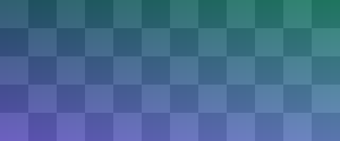

## Footnotes

The Persian آهسته covers two distinct areas[^areas]. An inline note works
like this ^[This is a note written straight into the text, with Persian کند
inside it.] and the sentence carries on.

[^areas]: Slowness, and low volume; cf. یواش = *softly*, which shares both
    areas but is colloquial.

## Links

The font is [Vazirmatn](https://github.com/rastikerdar/vazirmatn), released
under the SIL Open Font License. A URL with awkward characters:
[search](https://example.org/q?a=1&b=2#frag_x~y), and a link on Persian text:
[فرهنگ](https://www.vajehyab.com/). A document in this library can link to
another one by its name — this link points at this very document:
[a document link](doc:Feature test).

## Colours

The four marked words: [آهسته]{crimson}, [یواش]{indigo}, [کند]{teal},
[تند]{violet}, and a coloured gloss [گرم]{amber} = *warm*.

A marked word inside a list:

- **Attributive** [ماشینِ کند]{teal} = *a slow car*.
- **Predicative** [اینترنت کنده]{amber}, with a note[^reg].

[^reg]: Colloquial register.

| Word | Note | Colour |
|---|---|---|
| آهسته | with a note[^tab] | [آهسته]{crimson} |
| تند | — | [تند]{violet} |

[^tab]: A note inside a table cell.

> A highlighted box with a note[^box] and a [link](https://example.com).

[^box]: A note inside the highlighted box.

## Figures

An image uploaded by the user, laid out with a click:

{width=60 align=center offset=0}

And a figure supplied as a PDF, shown as vector:

{width=41 align=center offset=0}

## [یواش]{indigo} | yavâš | a coloured lemma — the heading itself can be marked

- **Correct** ✅ یواش برو = *go slowly*.
- **Wrong** ✗یواشِ برو with the *ezâfe* is ungrammatical.

## Video

An embedded clip (1′56″–2′20″) from one of the toolbox's own videos:

@[Counting the birds — Simorgh, part 1](https://www.youtube.com/watch?v=nFoM8JraEek){width=60 align=center offset=0 start=116 end=140}

## Latin blocks

[This dedication goes to the right, as on a title page.]{la align=right bg=quote}

[A narrow, shifted block, with گرم = *warm* inside it.]{la align=center bg=sage width=45 offset=20}

An ordinary paragraph, for comparison.

## RTL blocks

[
من بی می ناب زیستن نتوانم⏎
بی باده کشید بار تن نتوانم⏎
من بنده آن دمم که ساقی گوید⏎
یک جام دگر بگیر و من نتوانم
]{fa bg=lilac}

[
من بی می ناب زیستن نتوانم⏎
بی باده کشید بار تن نتوانم⏎
من بنده آن دمم که ساقی گوید⏎
یک جام دگر بگیر و من نتوانم
]{fa font=nastaliq bg=sand}

درود! این یک پاراگراف ساده است.

## درود! | dorud | a greeting, and Persian prose beside English

[
درود!!! امروز هوا آفتابی است 😀⏎
به پارک رفتیم.⏎
کمی فارسی تمرین کردیم
]{fa}

A paragraph of English prose sits between two Persian blocks. The block above
is one right-to-left unit, punctuation and emoji kept in reading order, each
⏎ a real line break.

[
حالا بلدم آهسته بخوانم و بنویسم.⏎
امروز یک فایل PDF فرستادم
]{fa}

A Latin word inside a Persian block stays where it was typed. And a block may
close a paragraph of English:⏎
[خسته نباشید!]{fa}
